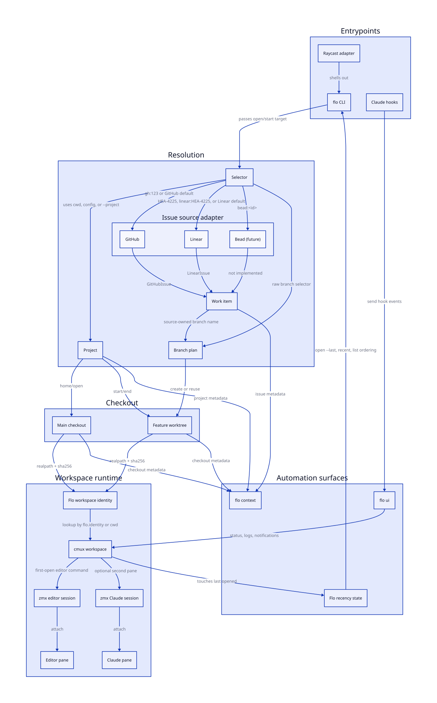

# Flo

Flo turns a work selector into the right git checkout, `cmux` workspace, `zmx` session, editor pane, and agent context.

Flo is a local workflow CLI for developers who keep several projects and git worktrees active at the same time. It assumes that real work starts from a project, a branch or issue, and a terminal workspace that should be reopened without rebuilding the room by hand.

Starting work usually means remembering which repository owns the task, how the branch should be named, where the worktree should live, whether a workspace already exists, and what context an agent needs. Those decisions are small on their own and expensive when repeated all day.

Flo makes that chain explicit. `flo open` returns to a project's main checkout. `flo start` resolves issue or branch work into a feature checkout. Both commands create or focus a `cmux` workspace and run the same first-open layout only when no existing workspace state can be reused. `flo context` exposes the resolved state to Claude, hooks, and other automation.

## Quickstart

Flo is currently used from a source checkout. The package has a `flo` binary, but the public contract is still early and the version is `0.0.0-dripip`.

Prerequisites for normal use:

- `bun` for developing or running Flo from this repo
- `git`
- `cmux`
- `zmx`
- `fzf`
- `nvim`, unless `EDITOR` or Flo runtime config points elsewhere
- `claude`, if you use the default second pane or Claude hook bridge
- `gh`, for GitHub issue selectors
- `LINEAR_API_TOKEN`, for Linear issue selectors

Run Flo from the checkout:

```bash
git clone git@github.com:jasonkuhrt/flo.git
cd flo
bun install
bun run cli help
bun run cli doctor
```

Create a starter config from the current repository:

```bash
bun run cli config init
```

The default config path is `~/.config/flo/config.json`. To try the command without touching your real config, set `FLO_CONFIG_PATH`:

```bash
FLO_CONFIG_PATH=/tmp/flo-config.json bun run cli config init --json
FLO_CONFIG_PATH=/tmp/flo-config.json bun run cli doctor --json
```

Build and link a local `flo` command from this checkout:

```bash
bun run build
npm link
flo help
```

## Concepts

A **project** is a git repository Flo can discover or resolve by name, alias, or path. Projects come from explicit config, configured discovery roots, and the current git repository. A project can define a default issue source, source-specific settings, a worktree root, and workspace profiles.

A **selector** is the value passed to `flo open` or `flo start`. For `flo open`, selectors identify a project or a project checkout such as `heartbeat@feat-auth`. For `flo start`, selectors identify GitHub issues, Linear issues, future issue adapters, or raw branch names.

A **work item** is issue metadata returned by an issue source. GitHub work items come from `gh issue view`. Linear work items come from Linear GraphQL `searchIssues`. Branch selectors do not produce a work item; the branch name is the work.

A **checkout** is the directory where work runs. The main repository checkout is the main checkout. Feature work normally runs in a git worktree under the project worktree root. By default, that root is a sibling path shaped like `.flo-checkouts/<repo-name>`.

A **workspace** is the `cmux` workspace attached to one checkout. Flo treats the checkout path as the durable identity. The visible workspace title can change without breaking lookup because Flo stamps `cmux` status metadata with `flo.identity`, `flo.project`, and `flo.kind`.

A **workspace profile** controls first-open layout for `main` and `feature` workspaces. Profiles can set the editor command, Claude command, split direction, secondary pane, and focused pane. `zmx` owns restored terminal sessions after the first open.

## Architecture

Flo bridges four runtime systems:



The diagram source lives in [`docs/workflow-entities.d2`](docs/workflow-entities.d2).

| Flo concept          | Runtime mechanism                                                 |
| -------------------- | ----------------------------------------------------------------- |
| Project              | Git repository plus global or project-local Flo config            |
| Work item            | GitHub issue, Linear issue, or future issue-source adapter result |
| Checkout             | Main repository checkout or git worktree                          |
| Workspace            | `cmux` workspace selected by Flo metadata or checkout path        |
| Restored shell state | `zmx attach <session> <shell> -lc ...`                            |
| Agent context        | `flo context --json` or `flo context --env`                       |

`flo open` and `flo start` share the same workspace lifecycle:

```text
resolve config
  -> resolve project
  -> resolve checkout
  -> compute workspace identity from real checkout path
  -> find matching cmux workspace by flo.identity or cwd
  -> focus existing workspace, or create and initialize a new one
```

The first-open path creates a `cmux` workspace, renames it, stamps Flo metadata, sends the editor bootstrap command, optionally opens a second Claude pane, and records recency state in `~/.local/state/flo/state.json`. The restore path focuses the existing workspace and refreshes metadata. Flo does not replay init commands over restored state.

Source resolution is intentionally separate from checkout orchestration:

| Selector                          | Requirement                                        | Result                                                           |
| --------------------------------- | -------------------------------------------------- | ---------------------------------------------------------------- |
| `123` in a GitHub-backed project  | `defaultSource: "github"` or inferred GitHub repo  | Fetches GitHub issue `#123`, branch `issue/123-<title>`          |
| `gh:123`                          | Project has `github.repo` or inferred GitHub repo  | Fetches GitHub issue `#123`, branch `issue/123-<title>`          |
| `HEA-4225`                        | `LINEAR_API_TOKEN`                                 | Fetches Linear issue `HEA-4225`, branch `issue/HEA-4225-<title>` |
| `linear:HEA-4225`                 | `LINEAR_API_TOKEN`                                 | Same as explicit Linear key                                      |
| `4225` in a Linear-backed project | `defaultSource: "linear"` and `linear.team: "HEA"` | Fetches Linear issue `HEA-4225`                                  |
| `bead:<id>`                       | Future Bead issue adapter                          | Parsed, but execution is not implemented yet                     |
| `feat/my-branch`                  | None                                               | Creates or reuses a checkout for that branch                     |

## Configuration

Global config lives at `~/.config/flo/config.json`, unless `FLO_CONFIG_PATH` points somewhere else.

```json
{
  "discovery": {
    "roots": ["~/projects"]
  },
  "runtime": {
    "editorCommand": "nvim",
    "claudeCommand": "claude",
    "shellCommand": "/bin/zsh",
    "cmuxBin": "cmux",
    "zmxBin": "zmx",
    "fzfBin": "fzf",
    "workspacePrefix": "flo",
    "profiles": {
      "main": {
        "layout": {
          "splitDirection": "right",
          "secondaryPane": "claude",
          "focus": "editor"
        }
      },
      "feature": {
        "layout": {
          "splitDirection": "bottom",
          "secondaryPane": "claude",
          "focus": "editor"
        },
        "editorCommand": "nvim +FloFeatureInit"
      }
    }
  },
  "projects": [
    {
      "name": "flo",
      "path": "~/projects/jasonkuhrt/flo",
      "aliases": ["flow"],
      "defaultSource": "github",
      "github": {
        "repo": "jasonkuhrt/flo"
      }
    },
    {
      "name": "heartbeat",
      "path": "~/projects/heartbeat-chat/Heartbeat",
      "defaultSource": "linear",
      "linear": {
        "workspace": "heartbeat-chat",
        "team": "HEA"
      },
      "worktreeRoot": "~/projects/heartbeat-chat/.flo-checkouts/Heartbeat"
    }
  ]
}
```

Project-local config lives at `.flo/config.json` in a repository. It can define repo-owned defaults without repeating the project path:

```json
{
  "name": "heartbeat",
  "aliases": ["hb"],
  "defaultSource": "linear",
  "linear": {
    "workspace": "heartbeat-chat",
    "team": "HEA"
  },
  "workspaceProfiles": {
    "feature": {
      "layout": {
        "splitDirection": "bottom"
      },
      "editorCommand": "nvim +FloFeatureInit"
    }
  }
}
```

Malformed config fails during load with a config-path error. `flo doctor` reports the resolved config path, current project, current checkout, `cmux` availability, required commands, and Linear token readiness when a Linear-backed project is configured.

## Usage

Start from diagnostics:

```bash
flo doctor
flo status
flo list
flo recent --limit 5
```

Return to a project's main workspace:

```bash
flo open flo
flo home flo
flo open --last
```

Open an existing checkout:

```bash
flo open heartbeat@feat-auth
```

Start GitHub issue work:

```bash
flo start 42 --project flo
flo start gh:42
```

Start Linear issue work:

```bash
export LINEAR_API_TOKEN=lin_api_...
flo start HEA-4225 --project heartbeat
flo start linear:HEA-4225 --project heartbeat
```

Start branch work without an issue source:

```bash
flo start feat/cmux-launcher --project flo
```

Explain or preview before mutating anything:

```bash
flo explain open flo
flo explain start HEA-4225 --project heartbeat
flo init preview start 42 --project flo
```

Expose context to another tool:

```bash
flo context --json
flo context --env
```

End feature work:

```bash
flo explain end 42 --open-main
flo end 42 --open-main
```

`flo end` refuses to remove a dirty checkout unless `--force` is passed. It only applies to feature checkouts; use `flo open` or `flo home` to return to main.

Install optional integrations:

```bash
flo claude install-hooks
flo raycast status
flo raycast install
```

The Raycast extension delegates to the Flo CLI. The Claude hook bridge delegates Claude events into `flo ui` commands, which then write `cmux` status, logs, and notifications.

## Command Reference

| Command                                                              | Purpose                                                                                   |
| -------------------------------------------------------------------- | ----------------------------------------------------------------------------------------- |
| `flo`                                                                | Open the interactive `fzf` launcher over known workspaces.                                |
| `flo home [project]`                                                 | Open the canonical main workspace for the current or selected project.                    |
| `flo open [selector]`                                                | Open a project main workspace or a specific checkout.                                     |
| `flo open --last`                                                    | Reopen the most recent actionable Flo workspace.                                          |
| `flo start <selector>`                                               | Resolve issue or branch work, create or reuse a feature checkout, and open its workspace. |
| `flo explain open`, `flo explain start`, `flo explain end`           | Print the resolved plan without changing checkout or workspace state.                     |
| `flo init preview open`, `flo init preview start`                    | Show the first-open init plan and whether it applies now.                                 |
| `flo context [--json or --env]`                                      | Print resolved project, checkout, workspace, and issue context.                           |
| `flo status`                                                         | Show current directory, project, checkout, expected workspace, and active workspace.      |
| `flo list`                                                           | List discovered projects, checkouts, workspace identities, and open state.                |
| `flo recent`                                                         | List locally recorded recent work that still points at active checkouts.                  |
| `flo doctor`                                                         | Diagnose config, project discovery, runtime commands, and source auth.                    |
| `flo config init`                                                    | Write a starter global config for the current repo or cwd.                                |
| `flo claude install-hooks`                                           | Install Flo's Claude hook bridge into `.claude/settings.local.json`.                      |
| `flo raycast status`, `flo raycast install`, `flo raycast uninstall` | Inspect or manage the bundled Raycast extension.                                          |
| `flo end [selector]`                                                 | Close the feature workspace, kill its `zmx` sessions, and remove the worktree.            |
| `flo prune`                                                          | Prune stale git worktrees, stale Flo recency records, and orphaned Flo workspaces.        |
| `flo ui sync`, `flo ui log`, `flo ui notify`, `flo ui claude-hook`   | Update Flo-owned `cmux` UI state from hooks or automation.                                |

Most commands accept `--json` for automation. Mutating workspace commands accept `--dry-run` where the CLI usage says so.

## Programmatic API

The CLI is the stable surface for current users. The package export exists for bundled integrations and tests:

```ts
import { doctorFlo, explainStart, getFloContext, openWorkspace, startWork } from 'flo'
```

Core exports include target resolution, explain and preview helpers, workspace operations, context formatting, status/list/recent queries, config initialization, Raycast management, Claude hook installation, and Flo UI helpers. These functions take an explicit command context and most accept injectable dependencies for tests.

Because the package is still `0.0.0`, treat the CLI as the compatibility contract and the exported TypeScript functions as integration hooks that may change.

## Current Boundaries

- Linear execution is implemented for issue lookup, branch naming, start/explain/dry-run flows, context export, status detection from branch names, and doctor auth checks.
- The Bead issue adapter is only represented in selector and config types. Starting Bead work returns `SOURCE_UNSUPPORTED`.
- Flo does not close GitHub or Linear issues. `flo end` is local cleanup: workspace, `zmx` sessions, worktree, and optional return to main.
- Raycast support is a bundled development-mode extension that shells out to the configured `flo` binary.
- Claude support is a hook bridge and context surface, not a separate workflow engine.

## Glossary

#### Checkout

A filesystem checkout for a project. The main repository path is the main checkout; feature work usually uses a git worktree.

#### Project

A git repository known to Flo through config, discovery roots, or the current directory.

#### Selector

The user-facing string Flo resolves into a project, checkout, work item, or branch.

#### Work item

Issue metadata returned by a source adapter, currently GitHub or Linear.

#### Workspace

A `cmux` workspace attached to a checkout and identified by Flo metadata.

#### Workspace profile

Config for the first-open editor and pane layout for `main` or `feature` workspaces.

Licensed under [MIT](LICENSE).
